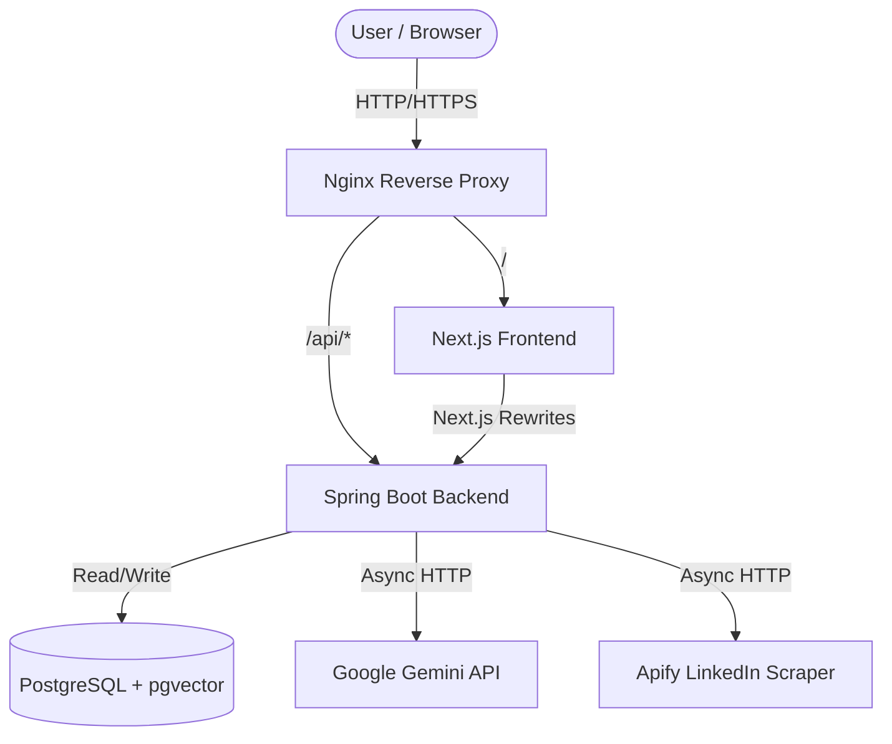
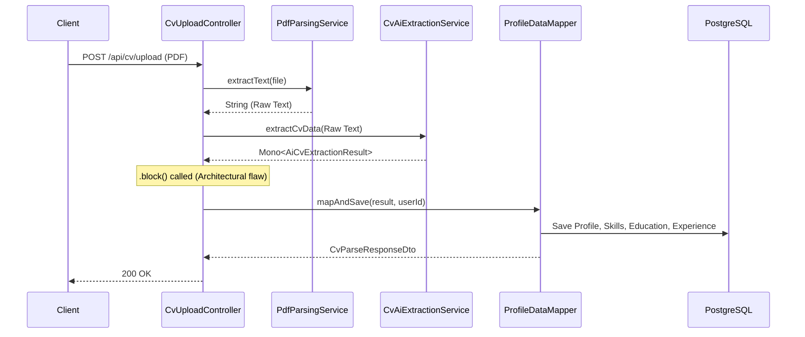

# JobFinder Architecture

This document describes the *actual* architecture of the JobFinder platform based on the current implementation.

## System Overview

JobFinder is built on a 3-tier monolithic Spring Boot backend and a Next.js frontend, orchestrated via Docker Compose.

## Backend Architecture

The backend strictly follows the Layered MVC pattern.

1. **Controllers (Presentation Layer):**
   - 8 REST Controllers handling HTTP requests, input validation (`@Valid`), and delegating to services.
   - 1 GraphQL Controller for specific auth operations.
   - *Violation:* `CvUploadController` blocks a WebFlux `Mono`, mixing reactive and imperative paradigms.

2. **Services (Business Logic Layer):**
   - Defines interfaces (`AuthInterface`, `JobInterface`, etc.) for abstraction.
   - Orchestrates transactions (`@Transactional`).
   - Uses dedicated sub-packages for AI (`ServiceAi`), assets (`assets`), and implementations (`implementation`).

3. **Repositories (Data Access Layer):**
   - Spring Data JPA repositories.
   - Advanced JPQL projections and native SQL queries (for `pgvector`).
   - *Risk:* Dynamic JPA Specifications (`JobSpecification`) lack fetch graphs, leading to N+1 query risks.

4. **Exception Handling:**
   - Centralized `@RestControllerAdvice` (`GlobalExceptionHandler`) intercepts all exceptions, formats them into an `ErrorResponse`, and applies the correct HTTP status code from the `ErrorCode` enum.

## Database Architecture

- **Engine:** PostgreSQL
- **Migrations:** Flyway (V1 to V5)
- **Key Tables:** 
  - `app_users`, `otp_codes` (Authentication)
  - `jobs`, `companies` (Job Listings)
  - `user_profiles`, `skills`, `user_skills`, `work_experience`, `education` (User Data)
  - `saved_jobs` (User interactions)
- **Vector Search:** `pgvector` extension is enabled. The `jobs` and `user_profiles` tables have a `vector(768)` column named `embedding`, indexed using HNSW (`idx_jobs_embedding_hnsw`, `idx_profiles_embedding_hnsw`) for fast nearest-neighbor semantic search.

## Authentication & Authorization Flow

1. **Registration:** User submits details. System generates a BCrypt hash and a 6-digit OTP, saving the user as `enabled=false`.
2. **Verification:** User submits OTP. System verifies it, setting `enabled=true`.
3. **Login:** User submits credentials.
   - On failure: `LoginAttemptService` increments attempts (in a `REQUIRES_NEW` transaction to prevent rollback). Locks account after 5 fails.
   - On success: Generates a stateless JWT.
4. **Authorization:** 
   - Requests hit `RateLimitFilter` (20 req/min for auth).
   - `JwtAuthenticationFilter` validates the token and populates the `SecurityContext`.
   - Controllers enforce roles via `@PreAuthorize`.

## Major Business Flows

### AI CV Parsing

### Semantic Job Matching
1. `JobAlertScheduler` (runs daily at 9:00 AM) fetches recently scraped active jobs.
2. Fetches users opted-in to email alerts.
3. For each user, the system evaluates their profile (Bio, Job Title, Skills).
4. `JobMatchingService` generates a `float[]` embedding for the user via Gemini API (cached for 30 days).
5. The embedding is passed to a native PostgreSQL query: `ORDER BY embedding <=> cast(:userVector as vector) LIMIT :limit`.
6. Matches above the user's threshold are sent asynchronously via `EmailNotificationService`.

## External Integrations

- **Google Gemini API:** Used via WebFlux `WebClient` to extract structured JSON from raw resume text and to generate 768-dimensional embeddings for semantic search.
- **Apify:** Triggered via the `AutonomousJobsScraperController`. Runs a LinkedIn scraper actor, polls for completion, and ingests the resulting dataset into the database. Both integrations are wrapped in Resilience4j circuit breakers to handle external downtime gracefully.

## Deployment Architecture

The application is containerized using Docker and defined in `docker-compose.yml`.

- **Nginx:** Acts as the reverse proxy. Terminates incoming connections on port 80/443, enforces security headers, and routes `/api/` and `/graphql` to the backend, and everything else to the Next.js frontend.
- **Frontend:** Next.js application built as a standalone Node.js server.
- **Backend:** Spring Boot application running on an embedded Tomcat server.
- **Observability:** Prometheus scrapes metrics from the backend's Spring Actuator endpoint (`/actuator/prometheus`), which are visualized in Grafana.
- **External Dependencies:** The database is expected to be hosted externally (e.g., Supabase) and is configured via environment variables.
