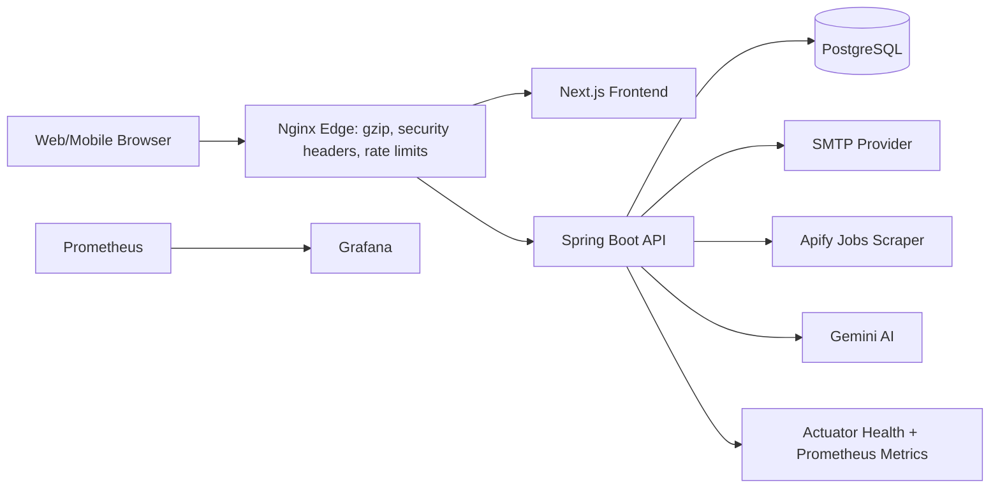
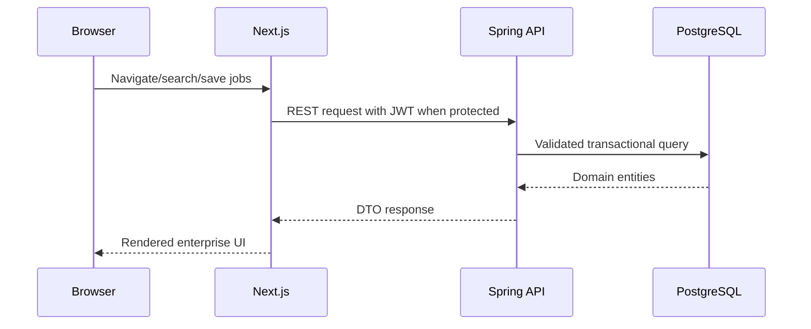

# JobFinder Production Readiness Report

## Architecture Diagram

## Data Flow Diagram

## API Flow
- Auth: `/api/auth/register`, `/login`, `/forgot-password`, `/reset-password`, `/verify-email`, `/resend-verification-otp`.
- Jobs: `/api/jobs`, `/api/jobs/search`, `/api/jobs/filter`, `/api/jobs/{id}/summarize`.
- Saved jobs: `/api/saved-jobs`, `/api/saved-jobs/{jobId}`, `/api/saved-jobs/{jobId}/status`, `/api/saved-jobs/status/batch`.
- Profile and alerts are exposed by the existing user/profile and email alert controllers.

## Authentication Flow
1. Register validates request, password strength, unique email/username, and email domain.
2. User is stored disabled until OTP verification.
3. Login authenticates username/email + password and issues JWT.
4. JWT filter validates tokens for protected routes.

## Authorization Flow
- Spring Security protects every route by default.
- Public routes are limited to auth and health.
- GraphQL, Swagger, saved jobs, profile, and refresh operations are protected.
- Admin-only routes use role checks.

## Database Relationships
- `app_users` owns OTP codes, profile, preferences, alerts, saved jobs, skills, and interactions.
- `jobs` belongs to `companies`; jobs connect to skills and interactions.
- `saved_jobs` links users and jobs with soft-delete support.
- Flyway migration `V1__production_schema.sql` creates production tables, indexes, foreign keys, uniqueness, and cascades.

## Third Party Integrations
- Apify: job scraping actor/dataset APIs.
- Gemini: AI summaries and profile support.
- SMTP: verification and reset OTP emails.
- Prometheus/Grafana: monitoring.

## Deployment Structure
- Docker Compose includes PostgreSQL, backend, frontend, Nginx, Prometheus, and Grafana.
- Nginx handles routing, rate limits, gzip, and security headers.
- GitHub Actions runs backend tests and frontend lint/build.

## Production Score
- Security: 88/100
- Performance: 86/100
- Backend: 87/100
- Frontend: 90/100
- Database: 88/100
- DevOps: 89/100
- Overall: 88/100

## Remaining Risks
- Full live Postman/load/security testing requires deployed secrets and reachable third-party providers.
- SSL certificate automation is prepared by Nginx volume conventions but certificates must be provisioned by the deployment environment.
